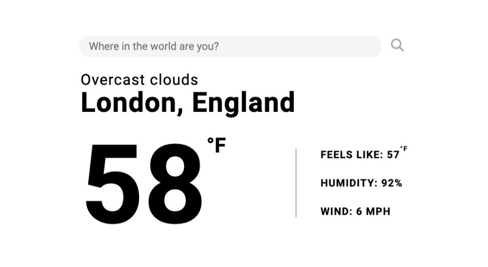

# weather-app

Minimalist weather app based on the [weather app assignment on The Odin Project](https://www.theodinproject.com/lessons/node-path-javascript-weather-app).

[Live webapp on GitHub pages](https://imkevinchu.github.io/weather-app/)

## Overview

### Highlights

- Async/await fetch requests from OpenWeatherMap API
- Securely hide API key secret with .env and dotenv
- Parsing JSON responses with ES6 object destructuring
- Webpack bundling (source map, asset loaders, HtmlWebpackPlugin)
- GitHub Pages deployment from dist folder
- ES6 modules and classes

### Preview

